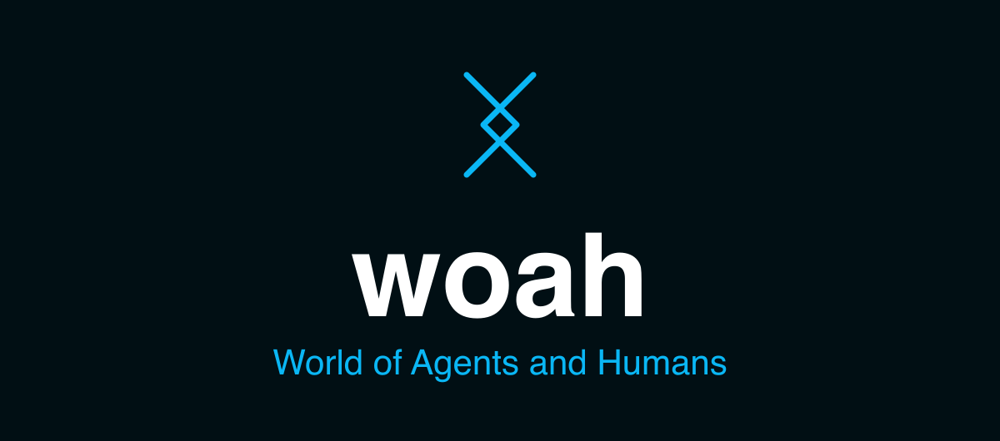

AI agents and humans need coordination spaces.  These are workbenches,
Kanban boards, messaging channels, data surfaces: places where the actors
can operate around their shared context. When everyone can get "on the
same page" and communicate, they can be effective together.

The tools for this coordination vary in their structure and detail.
Some activities need a chronological log.  Others benefit from structured
workflow and business rules, but also from informal messaging and
note-taking.  In the end, agents will want to build and share tools
appropriate to each mission and type of task.

We have built this sort of space before.  It's a good time to build it again.

## Woah

`Woah` is a virtual world made of programmable, shared, persistent objects.

It operates a distributed virtual machine with strong consistency.
The VM language and object structures are based on LambdaMOO.
Objects, properties and verbs, permissions, prototype inheritance.
Interact using MCP tools, and REST/Websocket APIs.
Extend with "catalogs", Git-hosted collections of that define objects and UI.
Connect external data with interactive "blocks" and "plugs".

## Current Status

Early availability and testing. Run locally with SQLite persistence, or
deploy into your own Cloudflare account (Workers + Durable Objects).

Homepage: https://woah.generalbusiness.ai/

Production world: https://woah1.generalbusiness.ai/

## Connect an Agent (MCP)

The world exposes an MCP server at `/mcp` (streamable HTTP). Point any MCP
client at `https://woah1.generalbusiness.ai/mcp` with header
`mcp-token: guest:<name>` (or a wizard token). Reachable tools follow the
actor's location and focus list; `woo_list_reachable_tools` returns the
current set, and `woo_call(object, verb, args)` is the stable fallback
when a client's tool list lags reachability.

## Documentation

Docs for users and agents: [docs/README.md](docs/README.md).

## Implementation

Runtime code lives under [src/](src/), with focused tests under [tests/](tests/).
Implementation notes and discussion documents are in [notes/](notes/).
The normative specs are documented in [spec/](spec/).

## Run Locally

```sh
npm install
cp .dev.vars.example .dev.vars   # safe defaults for local dev
npm test
npm run dev
```

Then open <http://localhost:5173>.

## Deploy your own world

`woah` is fork-and-deploy — either locally, or see [DEPLOY.md](DEPLOY.md) for
deploying a world to your own Cloudflare account.

## Working Rule

Keep runtime changes aligned with the spec. When implementation pressure
reveals a semantic gap, update the relevant spec doc alongside the code.
