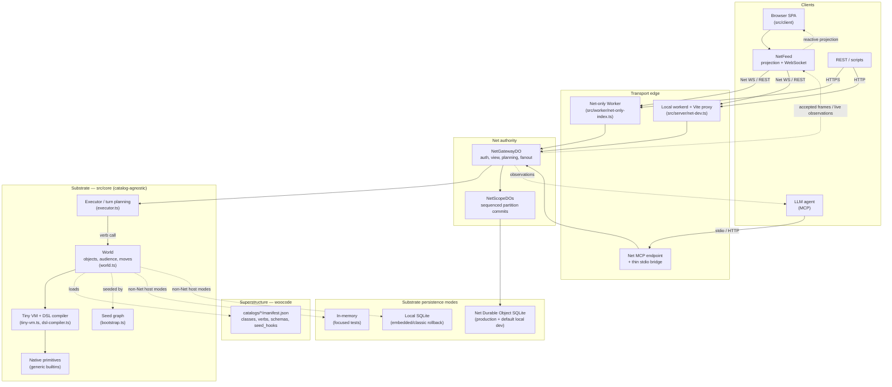

# Architecture at a glance

An orientation map for a running woo world. This is not the normative
reference; see [`../SPEC.md`](../SPEC.md) and [`../AGENTS.md`](../AGENTS.md).

## How to read it

**Clients.** The browser is a thin Net client: `NetFeed` maintains its
authoritative projection, submits turns, and reduces committed observation
frames. It does not execute a second local VM. Agents use the same Net gateway
through streamable HTTP MCP; stdio only changes JSON-RPC framing.

**Transport edge.** Production and default local development both run the
Net-only Worker entry. Local development adds Vite HMR and proxies stateful
routes to workerd. HTTP MCP lives in `NetGatewayDO`, and all client transports
converge there before authority is consulted.

**Net authority.** `NetGatewayDO` authenticates sessions, holds the client view,
plans turns through the catalog-agnostic executor, and fans out observations.
Each `NetScopeDO` owns one partition's ordered cells and relations. A turn is
durable only after the owning scope validates and commits it; the gateway's
planning image is not a second authority.

**Substrate (`src/core`).** Catalog-agnostic. `World` implements objects,
inheritance, permissions, audience selection, and move chains. The Tiny VM
executes bytecode compiled from Woo DSL. Native primitives are generic
functions for operations the DSL cannot yet express. The seed graph is the
minimal object set needed before catalogs install.

**Superstructure (`catalogs/`).** User-visible behavior lives in woocode:
classes, verbs, properties, schemas, and seed hooks declared in each catalog's
`manifest.json`. Bundled and third-party catalogs use the same install path;
the substrate does not branch on catalog identities.

**Persistence.** The substrate remains usable in-memory and with local SQLite.
Net deployments partition authoritative state across Durable Objects. Default
`npm run dev` uses the Net shape under workerd with persistent local DO state;
the former Node/SQLite transport is an explicit rollback lane.

**Observations.** The gateway returns direct turn results and fans committed
frames to affected sessions. `NetFeed` reduces browser frames into reactive
projection state and deduplicates submitter echoes. MCP queues expose the same
live fanout through `woo_wait`.

## Where to dig deeper

| If you care about… | Start here |
| --- | --- |
| What objects look like and how calls work | [`reference/`](reference/) |
| Writing verbs and packaging a catalog | [`designing/`](designing/) |
| Connecting as an LLM agent over MCP | [`agents/`](agents/) |
| Bridging external data into the world | [`blocks-and-plugs/`](blocks-and-plugs/) |
| Normative semantics | [`../SPEC.md`](../SPEC.md), especially `spec/semantics/core.md` |
| Net coherence and cutover | `spec/protocol/coherence.md`, `spec/operations/net-cutover.md` |
| Cloudflare deployment | `spec/reference/cloudflare.md` |
| Catalog format and installation | `spec/discovery/catalogs.md` |
