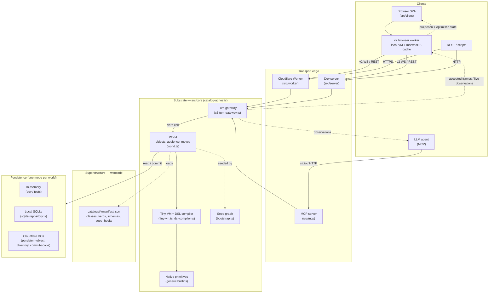

# Architecture at a glance

An orientation map for the moving parts of a running woo world. This is
a sketch, not the canonical reference — for normative behavior, see
[`../SPEC.md`](../SPEC.md); for contributor guidance, see
[`../AGENTS.md`](../AGENTS.md).

## How to read it

**Clients** are anything that originates a call: a person in a browser,
an LLM agent speaking MCP, or a script hitting REST. The browser path is
not just a renderer: the v2 worker keeps an IndexedDB execution cache,
can execute deterministic turns locally for optimistic UI, and then
confirms sequencing through the authoritative network path.

**Transport edge.** Three edges accept calls and produce observations.
The Cloudflare Worker is the production deployment. The dev server is
the Node-based loop used for local development and tests. The MCP
server is the protocol surface LLM agents use; in production it lives
inside the same Worker, in development inside the dev server. All
three converge on the same gateway — the difference is wire format,
not semantics.

**Substrate (`src/core`).** Catalog-agnostic. The turn gateway is the
authoritative funnel for network-submitted verb calls. Browser workers
may run the same deterministic turn locally first, but accepted durable
state still comes from the commit scope's sequencing and validation. The
`World` owns objects and the audience/move chains; the `Tiny VM` executes
verb bytecode compiled from the Woo DSL; native primitives are the small
set of functions the DSL invokes for things it cannot express. The seed
graph is the minimal object set delivered before any catalog installs.

**Superstructure (`catalogs/`).** All user-visible behavior lives here
as woocode — classes, verbs, properties, schemas, seed_hooks — declared
inline in each catalog's `manifest.json`. Catalogs install through the
same path third-party catalogs use; the substrate has no special
knowledge of any bundled catalog.

**Persistence.** A world runs in exactly one persistence mode for its
lifetime: in-memory (tests, ephemeral dev), local SQLite (small
self-contained deployments), or Cloudflare Durable Objects
(production — sharded across `persistent-object`, `directory`, and
`commit-scope` classes). The gateway and substrate above are the same
code in all three modes.

**Observations** are the return path. The gateway fans accepted frames
and live observations out to the audience the call computed (typically
the actor and others in the same space) over whichever transport each
recipient is on. Browser workers reduce those frames into projection
state and reconcile any local optimistic layer they produced before the
authoritative frame arrived.

## Where to dig deeper

| If you care about…                              | Start here                                                                |
| ----------------------------------------------- | ------------------------------------------------------------------------- |
| What objects look like and how calls work       | [`reference/`](reference/)                                                |
| Writing verbs and packaging a catalog           | [`designing/`](designing/)                                                |
| Connecting as an LLM agent over MCP             | [`agents/`](agents/)                                                      |
| Bridging external data into the world           | [`blocks-and-plugs/`](blocks-and-plugs/)                                  |
| Normative semantics (the spec)                  | [`../SPEC.md`](../SPEC.md), particularly `spec/semantics/core.md`         |
| Cloudflare deployment specifics                 | `spec/reference/cloudflare.md`                                            |
| Catalog format and installation                 | `spec/discovery/catalogs.md`                                              |
